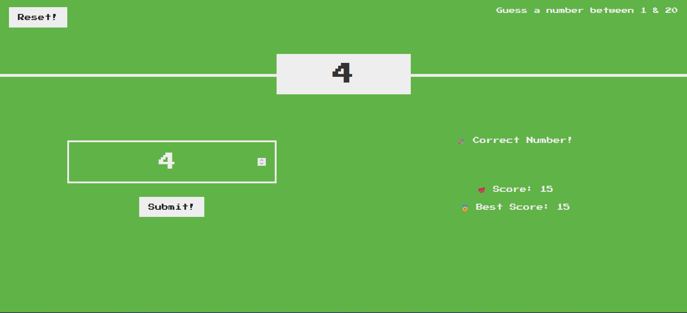
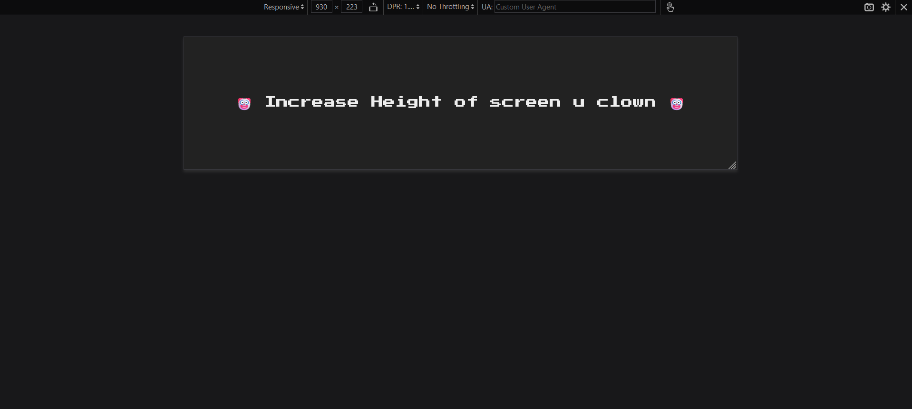

# NumberGuesser

# 💻 Tech Stack:
  

## DESCRIPTION
NumberGuesser is a simple web-based game where users try to guess a hidden number between 1 and 20. The game provides feedback on each guess, including whether the guess is too high, too low, or correct. Users can reset the game at any time to start a new round. The game keeps track of the current score and the highest score achieved.

## AUTHORS
- [Ali Hasan Jasim](https://github.com/AliHJMM)

## Usage

### How to Run
1. Clone the Repo
2. Navigate to the project directory
3. Open `index.html` in your web browser to start the game.

### Implementation Details

#### Algorithm

The game starts by generating a random number between 1 and 20. The user inputs their guess, and the game provides feedback on whether the guess is correct, too high, or too low. If the guess is correct, the background color changes to green, and the score is updated. If the guess is incorrect and the score drops to zero, the background color turns red to indicate the game is over. The user can reset the game at any time.

#### JavaScript Functions

- `startNewGame()`: Resets the game state, including score and hidden number, and updates the UI accordingly.
- `handleGuess()`: Processes the user's guess, updates the score, provides feedback, and adjusts the UI based on the outcome.

### CSS Styling

The CSS includes responsive design adjustments for various screen sizes and heights. The background color and layout of elements adjust based on the screen height to ensure usability across devices.

## Website Walkthrough

